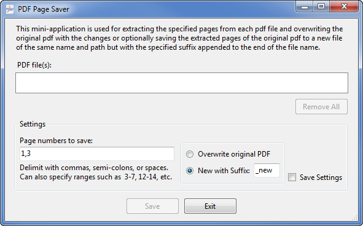
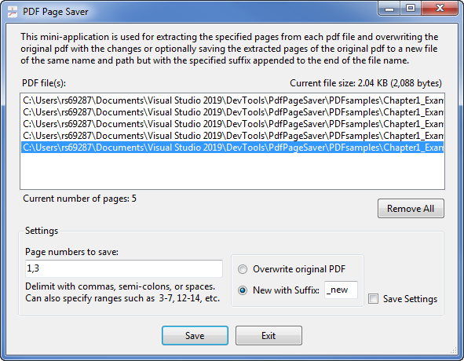

# PdfPageSaver

Saves the selected pages of one or more PDF files replacing the original file or as a new file of the same name of each of the original files but with a suffix appended to the original name.

+++ Options
