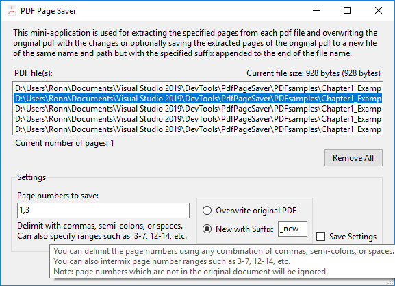

# PdfPageSaver

A Microsoft Window's mini-application useful for saving selected page numbers from one or 
many PDF files at a time replacing the original file with the selected page numbers or as 
a new PDF file having the same name as the original PDF file, but with a specified suffix 
appended to its original name.

This shows the typical window displayed when the application is first launched:

You can drag and drop PDF files from Windows Explorer directly onto the 'PDF file(s)' field 
in the application.

The next window shows several PDF files loaded into the list:

Notice the last PDF in the list as being initially selected. 

The size of the selected PDF file is displayed at the upper right of the list.

The number of pages in the PDF file is displayed at the lower left of the list.

#### Options

You can remove all the files from the list at once by clicking the 'Remove All' button.

You can specify individual page numbers to save (e.g. 1,2,4,5), 
or you can specify any number of page ranges (e.g. 1-3, 5-6)

There is also a context menu available when right-clicking on the 'PDF file(s)' field

In this example 'Save Selected' is chosen, so only that specific PDF file is saved:

You can hover the mouse over any of the fields to display a tooltip such as that 
shown at the bottom of the following image:

